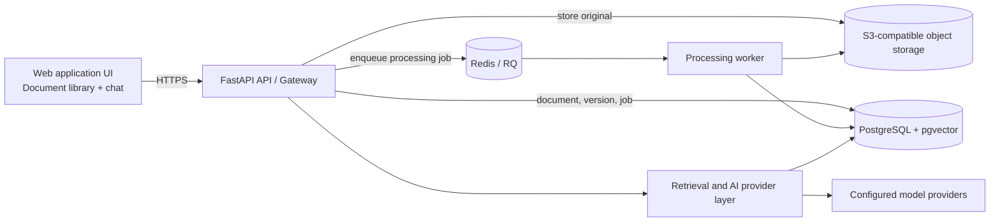

# Document Insight Platform Architecture

- **Status:** In Review
- **Date:** 2026-09-19

## Purpose and scope

This document plans the first production-minded slice of an internal Document Insight Platform. It accepts PDFs and images, stores original files, processes them asynchronously into searchable chunks, and serves authorized question-answering and semantic-search requests.

The design is container-first and runnable through Docker Compose. It intentionally does not prescribe a Kubernetes implementation yet; production orchestration and autoscaling require separate research and validation before they become an architectural commitment.

## System overview



## Components and responsibilities

| Component | Responsibility |
| --- | --- |
| Web application UI | Provides the document library and chat interface. It groups documents by department, allows tenant admins to manage a document's department assignments, sends an existing `document_id` only when the user replaces that logical document, and sends user questions to `POST /query`. |
| FastAPI API / gateway | The single public API; authenticates, authorizes, rate-limits, assigns correlation IDs, stores uploads, creates jobs, and orchestrates queries. |
| Object storage | Holds immutable original document versions. |
| PostgreSQL and pgvector | System of record for tenants, departments, users, logical documents, versions, jobs, chunks, entities, embeddings, and authorization metadata. |
| Redis / RQ | Delivers asynchronous processing jobs; PostgreSQL remains authoritative for job state. |
| Processing worker | Performs parsing/OCR, language detection, NER, chunking, embedding, lexical indexing, and version promotion. |
| Retrieval and AI provider layer | Selects explicit providers and implements authorized hybrid retrieval, reranking, evidence-grounded generation, and citations. |

## Data flow

### Request tracing

1. The API accepts an inbound `X-Correlation-ID` only when it is a valid UUID. Missing or
   invalid values are replaced with a generated UUID.
2. Middleware binds the selected value to `request.state.correlation_id` and a
   request-scoped context variable. All server log records contain a `correlation_id`
   field; logs outside HTTP request scope use `-`.
3. A completion log records the request method, path, response status, and duration. Query
   strings, request bodies, credentials, and document content are excluded.
4. Every response returns the ID in `X-Correlation-ID`, including unexpected-error
   responses. Clients can provide that value in support reports to locate the matching
   server logs.
5. Unexpected exceptions are logged with their stack trace and the same correlation ID,
   but the response exposes only a stable generic error. Raw exception messages and
   infrastructure details are not returned to clients.
6. Future queue publication includes the correlation ID in the durable job. Workers bind
   it to their own logging context, preserving the trace across API, queue, and processing
   boundaries.

### Local registration and login

1. Public registration creates a new tenant, its initial `General` department, and a
   `tenant_admin` in one database transaction. It never joins an existing tenant or
   accepts a caller-selected role.
2. Passwords are hashed with Argon2 before persistence. The initial administrator is
   assigned to `General` through `user_departments`; later administration flows may assign
   a user to multiple departments in the same tenant.
3. Login performs a normalized email lookup and constant-work password verification,
   returning the same public failure for unknown emails and incorrect passwords.
4. Successful login issues a short-lived signed JWT containing user, tenant,
   department, and role claims.

The initial relational identity model is:

```text
Tenant 1 --- * Department
Tenant 1 --- * User
User * --- * Department (through user_departments)
```

The database enforces that every user-department membership belongs to one tenant.
Document department membership uses the separate many-to-many model described in ADR 003.

### Ingest and version replacement

1. The UI submits a file to `POST /ingest`, optionally including a `document_id` for a replacement.
2. The API validates identity, department/role permissions, file signature, and the 25 MiB maximum. A new document receives a department set: an editor may select only departments they belong to, while a tenant admin may select any departments within their tenant.
3. The API writes the original file synchronously to object storage. A replacement inherits the existing document's department set.
4. The API creates a document version and durable queued job, then enqueues the job. It returns `202 Accepted` only after enqueueing succeeds.
5. The worker processes the file and writes version-scoped chunks, entities, embeddings, and lexical-index entries.
6. When processing succeeds, the worker promotes that version atomically only if it is newer than the document's current ready version. Until then, the prior ready version remains searchable.

### Query

1. The API authenticates the caller and derives the tenant, department, and role authorization scope.
2. It applies that scope before both lexical and vector retrieval.
3. It fuses candidates with RRF, reranks them, then sends only selected authorized passages to the configured generation provider.
4. The response includes the answer, evidence-confidence score, detected entities, and citations to the exact document version and passage.

## Deployment position

### Current commitment

- Every component runs in a container.
- Docker Compose starts the local API, worker, PostgreSQL/search extensions, Redis, and object storage.
- Configuration and secrets are external to application code.
- The public API is stateless; workers can scale independently when a suitable runtime is selected.

### Deferred production-orchestration decisions

- Kubernetes manifests, autoscaling rules, and managed queue/database selection are not decided yet.
- Before adopting Kubernetes, validate expected throughput, worker concurrency, queue behavior, persistent-volume requirements, health checks, rollout strategy, and the hosting team's operational standards.
- A simpler container platform with a managed load balancer and managed data services is an acceptable initial production path if it meets the security and reliability requirements.

## Key trade-offs

- A modular monolith with API and worker processes is preferred over day-one microservices: lower delivery overhead, but clear scaling seams.
- Asynchronous processing keeps upload requests quick and recoverable, at the cost of eventual consistency.
- Immutable document versions preserve auditability, at the cost of retaining historical storage and indexes.
- Authorization filtering before retrieval prevents data leakage, at the cost of every retrieval backend needing native metadata filtering.
- Hybrid retrieval improves exact-match and semantic recall, at the cost of a lexical-search implementation and reranking latency.

## Related decisions

- [ADR 001: Service boundaries](adr/001-service-boundaries.md)
- [ADR 002: Async processing and versioning](adr/002-async-processing.md)
- [ADR 003: Tenant isolation and security](adr/003-tenant-isolation.md)
