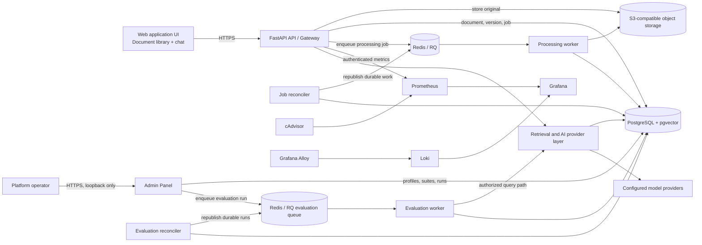

# Document Insight Platform Architecture

- **Status:** In Review
- **Date:** 2026-09-19

## Purpose and scope

This document plans the first production-minded slice of an internal Document Insight Platform. It accepts PDFs and images, stores original files, processes them asynchronously into searchable chunks, and serves authorized question-answering and semantic-search requests.

The design is container-first and runnable through Docker Compose. It intentionally does not prescribe a Kubernetes implementation yet; production orchestration and autoscaling require separate research and validation before they become an architectural commitment.

## System overview



## Components and responsibilities

| Component | Responsibility |
| --- | --- |
| Web application UI | Provides the document library and chat interface. It groups documents by department, allows tenant admins to manage a document's department assignments, sends an existing `document_id` only when the user replaces that logical document, and sends user questions to `POST /query`. |
| FastAPI API / gateway | The single public API; authenticates, authorizes, rate-limits, assigns correlation IDs, stores uploads, creates jobs, and orchestrates queries. |
| Object storage | Holds immutable original document versions. |
| PostgreSQL and pgvector | System of record for tenants, departments, users, logical documents, versions, jobs, chunks, entities, embeddings, and authorization metadata. |
| Redis / RQ | Delivers asynchronous processing jobs; PostgreSQL remains authoritative for job state. |
| Processing worker | Performs parsing/OCR, language detection, NER, chunking, embedding, lexical indexing, and ready-state transitions. |
| Job reconciler | Periodically recovers durable jobs that Redis did not receive, stale transient processing jobs, and retryable transient failures. It never retries permanent failures or exhausted jobs. |
| Observability stack | Prometheus scrapes authenticated API and cAdvisor metrics; Grafana Alloy collects Docker logs into Loki; Grafana provides the authenticated UI. These services are private except for an authenticated Grafana ingress. |
| Retrieval and AI provider layer | Selects explicit providers and implements authorized hybrid retrieval, reranking, evidence-grounded generation, and citations. |
| Admin Panel | Separately authenticated FastAPI app for platform operators: stages and activates capability/ingestion/query profiles, and manages evaluation suites, runs, and gate reviews. Loopback-bound; has no original-document or raw-passage access. See ADR 004 and ADR 006. |
| Evaluation worker and reconciler | Executes durable evaluation runs over the production-authorized query path and scores them against labelled test cases; the reconciler republishes lost queue deliveries and fails stale runs, mirroring the ingestion job reconciler. See ADR 006. |

## Data flow

### Request tracing

1. The API accepts an inbound `X-Correlation-ID` only when it is a valid UUID. Missing or
   invalid values are replaced with a generated UUID.
2. Middleware binds the selected value to `request.state.correlation_id` and a
   request-scoped context variable. All server log records contain a `correlation_id`
   field; logs outside HTTP request scope use `-`.
3. A completion log records the request method, path, response status, and duration. Query
   strings, request bodies, credentials, and document content are excluded.
4. Every response returns the ID in `X-Correlation-ID`, including unexpected-error
   responses. Clients can provide that value in support reports to locate the matching
   server logs.
5. Unexpected exceptions are logged with their stack trace and the same correlation ID,
   but the response exposes only a stable generic error. Raw exception messages and
   infrastructure details are not returned to clients.
6. Job creation persists the correlation ID on the durable processing job. Future queue
   publication carries that ID to workers, which bind it to their logging context and
   preserve the trace across API, queue, and processing boundaries.

### Local registration and login

1. Public registration creates a new tenant, its initial `General` department, and a
   `tenant_admin` in one database transaction. It never joins an existing tenant or
   accepts a caller-selected role.
2. Passwords are hashed with Argon2 before persistence. The initial administrator is
   assigned to `General` through `user_departments`; later administration flows may assign
   a user to multiple departments in the same tenant.
3. Login performs a normalized email lookup and constant-work password verification,
   returning the same public failure for unknown emails and incorrect passwords.
4. Successful login issues a short-lived signed JWT containing user, tenant,
   department, and role claims.

The initial relational identity model is:

```text
Tenant 1 --- * Department
Tenant 1 --- * User
User * --- * Department (through user_departments)
```

The Compose runtime connects restricted database roles through PgBouncer 1.24 in
transaction mode. Pools retain distinct database identities and transaction-local RLS.
Each role pool is limited to 10 backend connections, with an 80-connection database cap
and a five-second queue wait. PostgreSQL retains headroom for migrations and operations.
The pinned version enables protocol prepared-statement tracking by default. Authentication releases its
read transaction after constructing the authorization context. API query reads release
transactions before embedding, reranking, and generation calls; subsequent SQL rebinds
the verified actor through the transaction-start hook. Interactive API query embeddings
make one provider attempt and surface provider throttling as `503 query_provider_unavailable`;
background ingestion retains bounded embedding retries. This avoids holding interactive
requests through a 35-second embedding retry schedule when the provider is saturated.

The database enforces that every user-department membership belongs to one tenant.
The API refreshes role and department membership from PostgreSQL for each authenticated
request. Restricted database logins separate read-only query traffic, ingest and activation
writes, registration/login, job processing, reconciliation, and monitoring. Transaction-local
actor or job identity drives forced RLS on tenant-owned tables; missing scope fails closed.
The database owner credential is used only for migrations and role provisioning.
Document department membership uses the separate many-to-many model described in ADR 003.

### Ingest and version replacement

1. The UI submits a file to `POST /ingest`, optionally including a `document_id` for a replacement.
2. The API validates identity, department/role permissions, file signature, and the 25 MiB maximum. A new document receives a department set: an editor may select only departments they belong to, while a tenant admin may select any departments within their tenant.
3. The API writes the original file synchronously to object storage. A replacement inherits the existing document's department set.
4. The API creates a document version and durable queued job, then enqueues the job. It returns `202 Accepted` only after enqueueing succeeds.
5. The worker parses/OCRs the file, detects English or Croatian, and writes version-scoped
   canonical entity metadata through durable idempotent checkpoints. Only canonical
   RAG-relevant entity labels (`PERSON`, `ORG`, `GPE`, `LOC`, `PRODUCT`, `EVENT`, and
   `DATE`) are retained; repeated mentions increment a document-version-level occurrence
   count instead of creating duplicate rows. The worker then writes deterministic,
   page-aware chunks under the document version, retaining page and character offsets for
   citations. PostgreSQL generates a `simple` full-text index for each chunk; this temporary
   lexical index is not BM25. The worker then obtains profile-bound embeddings for every
   chunk through the configured Mistral embeddings endpoint and persists them with the
   embedding profile that produced them.
6. When processing succeeds, the worker marks that version `ready` but does not change the
   document's current pointer. A tenant administrator explicitly selects a ready version as
   current through the document library; until then, the prior current version remains searchable.

### Processing-job recovery

1. The reconciler runs as a private worker process on a configurable interval (60 seconds by
   default) and treats PostgreSQL—not Redis—as the authoritative job ledger.
2. It republishes jobs that were never recorded as enqueued or whose queued delivery became
   stale, recovers stale `processing` jobs within their retry budget, and requeues only failed
   jobs explicitly classified as transient.
3. Stale jobs that have exhausted the retry budget become terminal failures. Permanent failures
   are never auto-retried. The worker atomically claims only `queued` jobs, so duplicate queue
   messages cannot process a document version concurrently.

### Job status

1. `GET /jobs/{job_id}` authenticates the caller and applies tenant and current document
   department scope before returning job state.
2. Tenant administrators can inspect every job in their tenant. Editors and viewers can
   inspect a job only when the job's document intersects their department memberships.
3. Missing and unauthorized identifiers both return the same `404` response to avoid
   disclosing cross-tenant or cross-department job existence.
4. PostgreSQL is authoritative for status, attempt count, safe error code, lifecycle
   timestamps, server-generated idempotency key, and originating correlation ID. Queue
   metadata will never replace the database status contract.

### Query

1. The API authenticates the caller, refreshes their current membership, and derives the tenant, department, and role authorization scope.
2. A Redis-backed per-user quota atomically reserves the query before retrieval or provider work. The API returns `429` with `Retry-After` when the quota is exhausted and `503` when the quota store cannot be checked.
3. It resolves exactly one active query profile and builds an immutable retrieval request with
   mandatory tenant and department predicates derived only from the authenticated identity. An
   optional text `filter` is carried to entity matching and lexical retrieval; it never changes
   authorization scope. This preparation completes before any entity, lexical, or vector data is read.
4. It applies that scope before entity matching, lexical retrieval, and vector retrieval.
5. Query entities may add a document-level candidate or modest document-level boost. They do not select chunks or citations and are never a mandatory retrieval filter.
6. It fuses lexical and vector chunk candidates with RRF, reranks them, applies the configured
   insufficient-evidence and citation-quality thresholds, then sends only citable authorized
   passages to the configured generation provider.
7. The provider must return valid references to those supplied passages. The response includes
   the answer, evidence-confidence score, detected entities, and citations to the exact document
   version and passage; an ungroundable answer is returned as insufficient evidence.

### Entity metadata

Entities are document-version-scoped metadata for document selection, not chunk-level
retrieval records. A row is unique by `(document_version_id, label, normalized_value)` and
contains a display value, canonical label, normalized value, occurrence count, detected
language, and NER provider/model provenance. Character offsets are intentionally omitted:
the chunk index is the source of passage-level retrieval and exact citations.

### Capability configuration lifecycle

Chunking, lexical indexing, embedding, reranking, and generation use immutable capability
profiles selected through explicit database-backed activation rather than directly from
deployment environment variables. Jobs and index generations retain their ingestion
profile; each query resolves one query profile at its start. During an embedding or lexical
transition, queries search explicitly enabled compatible cohorts separately and fuse their
ranked results rather than comparing scores across incompatible vector spaces. See ADR 004
for the profile, activation, and audit model. A capability profile that can no longer be
resolved against the current provider schema is marked `retired` and excluded from every
future selection surface, without touching bundles that already reference it; see ADR 006.

A private platform-operator CLI stages and validates profiles and atomically activates
ingestion or query bundles with an expected revision and audit reason. It rejects a query
bundle that omits a cohort used by a ready generation, and rejects an ingestion bundle
until the active query bundle can read its new lexical and embedding cohorts.
A separately authenticated Admin Panel, started with the rest of the Compose stack, serves
the same operator workflow on the loopback-bound Compose port 8001. It has only the
dedicated profile-operator database
credential and cannot read original file contents or raw passages. It can read only
tenant-scoped document titles and current activated version IDs for the suite picker.
Production access requires an internal
TLS-protected ingress; the document API remains the only public service.

The Admin Panel also manages immutable, tenant-scoped evaluation suites and durable RQ
runs; see ADR 006 for the suite/run data model, execution lifecycle, and gate-review
workflow. A platform operator may select a tenant from an ID/name-only catalog, then select
its activated document versions from a title/version picker and current tenant-user IDs
for each case. Suite creator and case
execution identity are recorded separately. The panel's database role has no original
document, raw passage, or user-credential access. Operators can review generated answers
and citations from completed runs. Evaluation workers load each case's current tenant
identity and apply that user's role and department scope through the normal query path;
they reject a case identity or corpus version outside the suite's tenant. A run records
the selected tenant and verifies that it still matches the suite before execution.
The API-hosted upload page accepts a tenant editor or admin and sends file bytes only to
the public API. The Admin Panel never receives original files or tenant credentials.
Migration `20260923_0016` retains an isolated sample tenant for controlled ingestion
comparisons; its first administrator is provisioned with a one-time private setup command.
Migration `20260923_0017` seeds corpus-independent evaluation case templates. Operators
adapt them into immutable suites after selecting a corpus, current test identity, and
source labels; templates are never runnable on their own.
Query candidates run over the same explicitly selected tenant corpus. Ingestion candidates
remain limited to the isolated sample tenant: changing the ingestion selection for a live
tenant would affect its future uploads. Those comparisons use byte-identical copies indexed
under the sample-tenant-only selection. The worker stores stage measurements and manual
answer-quality reviews in PostgreSQL. Platform activation requires an operator-approved
completed comparison against the current baseline.

Reranking and generation system instructions are part of their immutable capability
snapshots and are supplied to the model from the resolved query profile. Prompt edits
therefore create new profile versions. Authorization, evidence selection, structured
response validation, and citation checks remain application-enforced safeguards.

## Deployment position

### Current commitment

- Every component runs in a container.
- Docker Compose starts the local API, processing worker, job reconciler, PostgreSQL/search
  extensions, Redis, object storage, the Admin Panel, evaluation services, and local
  observability together in one `docker compose up`; none of it is behind a Compose
  profile.
- Prometheus, cAdvisor, Loki, Grafana Alloy, and Grafana run with persistent local
  volumes. Production reuses the scrape/log schema but must
  use secret-managed credentials, authenticated Grafana ingress, encrypted durable storage,
  backups, retention, and Grafana contact-point routing. Grafana provisions and evaluates
  alert rules against Prometheus; notification destinations are configured separately.
  Prometheus, Loki, cAdvisor, Alloy, and `/metrics`
  remain private; the API's metrics endpoint requires a monitoring bearer token.
- Configuration and secrets are external to application code.
- The public API is stateless; workers can scale independently when a suitable runtime is selected.

### CI/CD scope and delivery boundary

The agreed delivery pipeline ends after publishing the application image to GitHub
Container Registry (GHCR). The workflow lives at
[`.github/workflows/ci.yml`](../.github/workflows/ci.yml) and Dependabot configuration
at [`.github/dependabot.yml`](../.github/dependabot.yml).

- Pull requests run formatting, linting, and strict type checks (`quality`); unit,
  service-integration, and the authenticated ingest-to-query end-to-end scenario
  including denied department access, all with at least 70% branch coverage (`test`);
  a dependency vulnerability scan of the locked production dependencies (`dependency-audit`);
  and a Docker build check with an image vulnerability scan (`docker-build`). The `test`
  job creates a disposable, CI-only `.env` from `.env.example` so the real
  `database-test`/`redis-test` Compose services back the integration and end-to-end
  tiers and their required service tests run rather than silently skip because their
  test configuration is missing.
- Pushes to `main` repeat the same required checks, then `publish` builds and pushes the
  application image to GHCR with a commit-SHA tag and records its registry digest in the
  workflow run summary. Failed checks prevent publication. Pull requests do not receive
  registry write credentials: `publish` only runs on `push` to `main` and is the only job
  granted `packages: write`.
- Dependabot opens weekly dependency (`uv`), base-image (`docker`), and GitHub Actions
  update pull requests, which pass through the same checks before merging.
- Docker Compose remains the local startup method for the complete stack. Application
  processes share the repository's Dockerfile with different commands; infrastructure
  services use their own images. Compose describes the stack, not a single combined
  image to publish.

The assignment's deliverables table asks for image publication on every push, while
its engineering requirements specify build/push on `main`. This project deliberately
uses pull-request validation and publication from `main`, following the latter wording.
Image publication is required; a publicly hosted application is not explicitly required.

GHCR stores the built image; it does not run the services. Ending at publication provides
a versioned delivery artifact without committing this exercise to a hosting environment
or ongoing infrastructure costs. Local Compose execution demonstrates the running system.
This is continuous integration and image delivery, with no automated deployment stage.

The next step, if hosting is later requested, is to deploy the published image by digest
alongside the required private services. That work includes environment-specific secrets,
TLS, durable encrypted storage and backups, migrations, health checks, and a rollback
plan. Publishing or deploying an image does not implicitly activate capability profiles;
the explicit activation rules in ADR 004 still apply.

### Planned: environment-scoped configuration at deploy time

Not implemented; recorded here so the deploy stage has an agreed shape when it is
requested rather than an ad hoc one. The published image stays environment-agnostic per
this document's [current commitment](#current-commitment) that configuration and secrets
are external to application code: `Settings` reads configuration from the process
environment at container startup, and the Dockerfile bakes in no config or secrets.
Deployment only needs to decide how each target environment's variables reach that
startup, not change the image.

- Model each target (`staging`, `production`, ...) as a GitHub **Environment**
  (Settings → Environments), holding that environment's own secrets and variables
  (`DATABASE_*_URL`, `MISTRAL_API_KEY`, `JWT_SECRET_KEY`, `S3_*`, `METRICS_BEARER_TOKEN`,
  and so on). These are distinct from repository-level secrets and from the disposable,
  randomly generated `.env` the `test` job creates for its own ephemeral Compose
  containers (see [CI/CD scope](#cicd-scope-and-delivery-boundary) above) — that file
  never carries real credentials and is unrelated to deployment configuration.
- Add a `deploy.yml` workflow, triggered after `publish` succeeds (or manually), with one
  job per target that declares `environment: staging` / `environment: production`.
  GitHub injects that environment's secrets/variables into the job only, scoped to that
  run; nothing is written into the image or the repository.
- Deploy by digest, not by rebuilding: pull the exact
  `ghcr.io/<owner>/<repo>@sha256:...` the `publish` job already recorded, so what was
  scanned and tested is bit-for-bit what runs.
- Use environment protection rules for gating: `production` can require reviewer
  approval and restrict deployment to `main`, while `staging` can deploy automatically.
  This is the natural place for the rollback plan and health-check gate this section
  already calls out.
- This mirrors the pattern Docker Compose already uses locally (`environment:` entries
  sourced from a local `.env`); the only change is the source of truth becoming GitHub's
  per-environment secret store instead of a developer's local file.

### Deferred production-orchestration decisions

- Kubernetes manifests, autoscaling rules, and managed queue/database selection are not decided yet.
- Before adopting Kubernetes, validate expected throughput, worker concurrency, queue behavior, persistent-volume requirements, health checks, rollout strategy, and the hosting team's operational standards.
- A simpler container platform with a managed load balancer and managed data services is an acceptable initial production path if it meets the security and reliability requirements.

## Key trade-offs

- A modular monolith with API and worker processes is preferred over day-one microservices: lower delivery overhead, but clear scaling seams.
- Asynchronous processing keeps upload requests quick and recoverable, at the cost of eventual consistency.
- Immutable document versions preserve auditability, at the cost of retaining historical storage and indexes.
- Authorization filtering before retrieval prevents data leakage, at the cost of every retrieval backend needing native metadata filtering.
- Hybrid retrieval improves exact-match and semantic recall, at the cost of a lexical-search implementation and reranking latency.

## Related decisions

- [ADR 001: Service boundaries](adr/001-service-boundaries.md)
- [ADR 002: Async processing and versioning](adr/002-async-processing.md)
- [ADR 003: Tenant isolation and security](adr/003-tenant-isolation.md)
- [ADR 004: Capability configuration profiles](adr/004-capability-configuration-profiles.md)
- [ADR 005: Observability](adr/005-observability.md)
- [ADR 006: Evaluation suite admin dashboard and run lifecycle](adr/006-evaluation-admin-dashboard.md)
