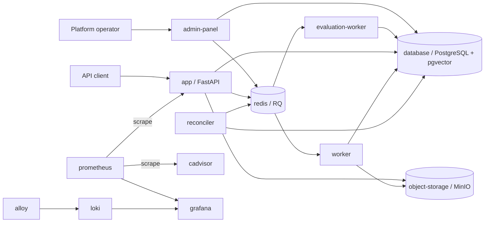

# Applications and services

This page explains the containers defined in [`docker-compose.yaml`](../../docker-compose.yaml):
what each one does, when it runs, and whether it has a browser or HTTP endpoint. A single
`docker compose up --build` starts the complete stack: the API, workers, the Admin Panel,
evaluation services, and the local observability stack all start together. Nothing is
gated behind a Compose `--profile` flag.

## At a glance

| Service | Purpose | Started by | Access from the host |
| --- | --- | --- | --- |
| `app` | FastAPI gateway for authentication, document ingestion, jobs, document administration, and evidence-grounded queries | Default | `http://127.0.0.1:8000` (Compose publishes port 8000 on all host interfaces) |
| `worker` | RQ process that extracts text, runs OCR and NER, chunks documents, creates embeddings, and marks versions ready | Default | No HTTP port |
| `reconciler` | Recovers durable jobs that were not queued or became stale; retries eligible transient failures | Default | No HTTP port |
| `database` | PostgreSQL with pgvector; system of record for identities, documents, versions, jobs, profiles, chunks, and vectors | Default | `127.0.0.1:5432` for local database tools |
| `redis` | RQ job delivery and query rate-limit state | Default | No host port |
| `object-storage` | MinIO storage for immutable original uploads | Default | No host port |
| `admin-panel` | Browser interface for platform operators to create, review, validate, and activate configuration profiles | Default | `http://127.0.0.1:8001` |
| `evaluation-worker` | Runs saved baseline/candidate comparisons through the authorized RAG query path | Default | No HTTP port |
| `evaluation-reconciler` | Republishes evaluation runs left pending after a queue failure | Default | No HTTP port |
| `profile-operator` | Command-line alternative for the same profile approval workflow | Default (runs its default `--help` command and exits; invoke specific commands on demand) | No HTTP port |
| `grafana` | Dashboards, log exploration, and alert-rule evaluation | Default | `http://127.0.0.1:3001` |
| `prometheus` | Collects metrics from the API and cAdvisor | Default | No host port |
| `cadvisor` | Supplies Docker resource metrics to Prometheus | Default | No host port |
| `alloy` | Collects Docker logs and forwards them to Loki | Default | No host port |
| `loki` | Stores and serves logs to Grafana | Default | No host port |

`database-test` and `redis-test` also start by default now, alongside `test-migrate` and
`test-bootstrap-roles`, which prepare the disposable test database. They exist for
integration tests; the application does not use them at runtime.

## How the applications work together



The API stores an original upload before accepting its job. The worker later creates
version-scoped search data. A tenant administrator selects which ready document version
is current. A platform operator separately activates ingestion and query configuration
profiles through the Admin Panel. New jobs use the active ingestion profile at creation;
existing jobs keep their assigned profile. Each query uses the active query profile
resolved at request start. Older indexed documents remain searchable while the query
profile includes their lexical and embedding read cohorts.

## User-facing endpoints

### API (`app`)

The API is the application's public service. Its local OpenAPI page is
`http://127.0.0.1:8000/docs`. Clients use authenticated endpoints such as `POST /ingest`,
`POST /query`, and `GET /jobs/{job_id}`. The API enforces tenant and department access
before retrieval. Its `/metrics` endpoint is for authenticated Prometheus scraping,
not ordinary API clients.

### Document Insight Admin Panel (`admin-panel`)

Starts automatically with `docker compose up --build`; open
`http://127.0.0.1:8001/`. Sign in with `ADMIN_PANEL_USERNAME` and
`ADMIN_PANEL_PASSWORD` from the local `.env`. The panel stages capability profiles,
validates supported configurations, assembles ingestion and query bundles, and activates
them with an expected revision and audit reason. It uses a dedicated profile-operator
database login and does not have document-content access. The local port is bound to
loopback; production requires an internal TLS-protected ingress.

The `profile-operator` CLI offers the same approval workflow for scripts or emergency
operations. It uses `DATABASE_PROFILE_OPERATOR_URL`, separate from the public API and
worker credentials, and reads local JSON configuration files from a `profiles/`
directory. `docker compose up` also starts it, but with its default `--help` command, so
it exits immediately; run a specific command on demand with
`docker compose run --rm profile-operator <command>`:

1. `create-capability --capability embedding --name mistral-embed-v2 --config-file /app/profiles/embedding-v2.json` stages a draft and prints its ID.
2. `validate-capability PROFILE_ID` approves the draft after schema, adapter, and runtime checks.
3. `create-ingestion --ner ID --chunking ID --lexical ID --embedding ID` stages a bundle, reusing approved IDs for unchanged capabilities.
4. `create-query --lexical OLD_ID NEW_ID --embedding OLD_ID NEW_ID --reranker ID --generation ID --retrieval-file /app/profiles/retrieval.json` stages a query bundle that reads both old and new indexes.
5. Review the proposed policy with `show-capability PROFILE_ID`, `show-query PROFILE_ID`, and `show-ingestion PROFILE_ID`. `show-active` prints the active IDs and revisions. Activate the query bundle with `activate --kind query --profile-id ID --expected-revision N --actor-id OPERATOR_UUID --reason "enable both cohorts"`. Then activate the ingestion bundle with its own expected revision.

Keep runtime credentials for every provider used by an active query cohort. This
deployment supports Mistral embedding, reranking, and generation; another provider
requires its adapter and credential before validation. Existing jobs retain their
persisted ingestion profile. Query activation refuses to omit cohorts referenced by
ready index generations, so older indexed documents remain searchable.

### Evaluation suites and manual quality gate

Normal tenants are created through `POST /auth/register` (see the [API documentation](http://127.0.0.1:8000/docs)); registration returns the tenant and initial administrator IDs. They appear automatically in the Admin Panel's tenant selector. Registration creates a new tenant, not another user in an existing tenant. The current API has no invitation flow for adding narrower test users; cases for editors or viewers require identities that have already been provisioned through an approved identity workflow.

1. The panel and evaluation workers start automatically with
   `docker compose up --build`. Sign in to the
   [Admin Panel](http://127.0.0.1:8001/evaluations/suites) with the separate
   `ADMIN_PANEL_USERNAME` and `ADMIN_PANEL_PASSWORD` credentials.
2. Select a tenant in **Evaluation Suites**, then **Create Suite**. The panel shows
   activated documents from that tenant by title and version ID; it cannot browse
   originals or raw passages. Select a document version in the dropdown and click
   **Add document**. You can add several documents to the suite.
   The API-hosted [upload page](http://127.0.0.1:8000/evaluation-corpus/upload) can
   create new test documents: sign in with an editor or admin from the same tenant, upload,
   wait for `ready`, and have a tenant admin activate the version. Return to the suite
   form and click **Refresh documents** to select it.
   The upload page shows the selected tenant name and ID before sign-in and rejects a
   login from another tenant. The access token stays in that browser tab. Set
   `API_PUBLIC_BASE_URL` if the API uses
   a different public address.
3. Add cases manually or from the ten seeded **Baseline scenarios**. Templates are
   starting points, not runnable suites. For each case, enter the question and a current
   user UUID from the selected tenant. The upload page shows the signed-in user's UUID;
   initial tenant registration also returns it. That user's current role and department membership
   determine what can be retrieved. The first case must use a tenant administrator so
   the worker can validate the whole corpus; later cases can test narrower access.
   For answerable cases, label evidence as `version_uuid@page:start:end` (page numbers
   start at 1; offsets are page-local). Check **These are all relevant spans** only after
   labelling every relevant passage. Unanswerable cases have no relevant spans. The
   optional query filter narrows matching; expected facts and rubric guide manual review;
   tags organize cases but do not affect scores. **Show saved case data** previews the
   form's JSON. Saving creates an immutable suite revision and does not start a run.
4. On the suite detail page, choose a candidate query policy and run it against the same
   selected document versions as the active baseline. Results appear under
   **Evaluation Runs**. Review stage rankings, citations, answers, metrics, errors, and
   timing. Score every candidate answer from 0 to 1, then approve or reject the completed
   run with a reason. An approved run against the current active baseline can authorize
   platform query activation. The worker uses each case's live tenant permissions and
   rejects foreign users or documents. The panel displays generated answers and citations
   for review but receives no original files, raw passages, or user credentials.

**Ingestion comparisons** remain on the isolated sample tenant because selecting an
ingestion policy changes future uploads. Migration `20260923_0016` creates that tenant and
its `General` department. Set `EVALUATION_TENANT_ID` to the seeded UUID in `.env.example`.
The migration creates no credentials; provision its first administrator once with:

```bash
docker compose run --rm evaluation-identity-init \
  --email YOU@EXAMPLE.COM --display-name "Test Admin"
```

The command prompts for a password and refuses to add a second user. In **Test corpus
setup**, select the candidate ingestion policy for new uploads in this isolated tenant.
Upload byte-identical copies as separate new documents, wait for processing, activate
them, and enter a source-version to candidate-version JSON mapping on the suite detail
page. The worker checks ownership, readiness, activation, original-file hashes, index
provenance, and query read-cohort compatibility. For regular tenants, the suite detail
page offers query comparisons only. The evaluation reconciler republishes runs left
pending after queue failure.

### Grafana (`grafana`)

Starts automatically with `docker compose up --build`; open
`http://127.0.0.1:3001/`. Sign in as `admin` using `GRAFANA_ADMIN_PASSWORD` from
`.env`. Prometheus, Loki, cAdvisor, and Alloy are supporting services without published
host ports. See [ADR 005](../adr/005-observability.md) for the signals and production
requirements.

Provisioned dashboards: **Document Insight System** for API traffic and container CPU,
memory, and task-state signals; **Document Insight RAG** for query latency and evidence
outcomes (it does not display Recall@K or Precision@K — those require labelled offline
evaluation data, see [evaluation suites](#evaluation-suites-and-manual-quality-gate)
above); **Document Insight Ingestion** for durable jobs by status, the age of the oldest
queued or in-flight job, jobs awaiting retry, terminal failures, worker/reconciler
liveness, and per-stage processing outcomes and latency, sourced from PostgreSQL's
authoritative ledger rather than transient Redis queue state; **Document Insight Logs**,
which starts at a 24-hour window and filters Docker logs by service; and
**Document Insight Alerts** for current Grafana-managed alert states — inspect every
rule, including healthy ones, under **Alerting → Alert rules**.

On Docker Desktop, cAdvisor may expose only an aggregate host cgroup rather than
individual container cgroups; the memory panel then shows the available aggregate
instead of per-service memory.

Set strong `METRICS_BEARER_TOKEN` and `GRAFANA_ADMIN_PASSWORD` values before starting the
stack. Grafana provisions and evaluates alert rules against Prometheus; no external
Alertmanager, contact point, or custom notification policy is configured, so notification
delivery must be configured and tested in Grafana before production use. Prometheus uses
that token only inside the Compose network to scrape the private `/metrics` endpoint; the
API returns `404` for that endpoint when no token is configured. Prometheus, Loki,
cAdvisor, and Alloy do not publish host ports.

Worker, reconciler, and API metrics use Prometheus multiprocess files on a private shared
volume, reset once before the services start. This makes worker-stage durations, provider
outcomes, recovered/exhausted-job totals, worker heartbeat, and worker/reconciler
last-success timestamps available through the authenticated API scrape without exposing a
worker port. The worker heartbeat advances during idle polling and while RQ monitors an
active job; last completed-job time is intentionally separate. Grafana alerts when the
worker heartbeat or reconciler success becomes stale, or a processing job remains in
flight too long. The shared multiprocess volume is a local Compose arrangement:
independently recreating containers can reuse process IDs and corrupt the metric files,
making `/metrics` fail. After such a restart, stop the API, worker, and reconciler
together, run `docker compose run --rm prometheus-multiproc-init`, then start them
together. Before production deployment, replace this shared-file collection with a
restart-safe per-instance metric collection design and test rolling restarts.

For production, deploy the same scrape configuration on private infrastructure with
encrypted persistent storage, secret-manager supplied monitoring and Grafana credentials,
an authenticated Grafana ingress, backups, Grafana contact points and notification
policies, and production-appropriate retention. Do not expose Prometheus, Loki, cAdvisor,
Alloy, or `/metrics` directly to the internet. The local single-binary Loki instance is
intended for development; use the organization's managed log platform or a production
Loki deployment for scale and HA.

Every HTTP request receives a UUID correlation ID (a valid inbound `X-Correlation-ID` is
preserved; otherwise the API generates one), returned in the `X-Correlation-ID` response
header and included as a `correlation_id` field on every server log line — request-scoped
logs and exception tracebacks use the response ID, while work outside an HTTP request uses
`-`. See [ARCHITECTURE.md's request tracing](../ARCHITECTURE.md#request-tracing) for the
full propagation contract.

## Background and storage services

- **Worker:** Consumes the `ingestion` RQ queue. It parses PDF and image uploads,
  detects language, extracts entities, creates chunks and embeddings, and moves a
  processed version to `ready`. Processing never activates a document version.
- **Reconciler:** Checks PostgreSQL's durable job ledger and republishes missing or stale
  work within the retry policy. It does not retry permanent or exhausted failures.
- **PostgreSQL/pgvector:** Holds authoritative records, including profile activation
  pointers and audit history. The local database port is loopback-only; application
  containers connect on the private Compose network with restricted database roles.
- **Redis/RQ:** Delivers asynchronous jobs. PostgreSQL, rather than Redis, determines
  durable job state.
- **MinIO:** Stores original files. The default Compose configuration exposes neither
  its API nor its console on a host port.

## Startup helpers and test containers

Some Compose services run once and exit successfully:

| Service | Startup task |
| --- | --- |
| `object-storage-init` | Creates the original-upload bucket in MinIO |
| `migrate` | Applies Alembic database migrations |
| `bootstrap-roles` | Provisions restricted database login roles from external secrets |
| `prometheus-multiproc-init` | Clears the local shared metrics directory before API and workers start |
| `monitoring-token-init` | Writes the private metrics scrape token before Prometheus starts |
| `test-migrate`, `test-bootstrap-roles` | Prepare the disposable test database |
| `evaluation-identity-init` | Runs its default `--help` command and exits; invoke a real command on demand with `docker compose run --rm evaluation-identity-init <command>` |

These are setup jobs, so an `Exited (0)` status is expected. Use
`docker compose ps -a` to see the current local state and
`docker compose logs -f app worker reconciler` to follow the core processes. For setup
and configuration details, see the [project README](../../README.md).
