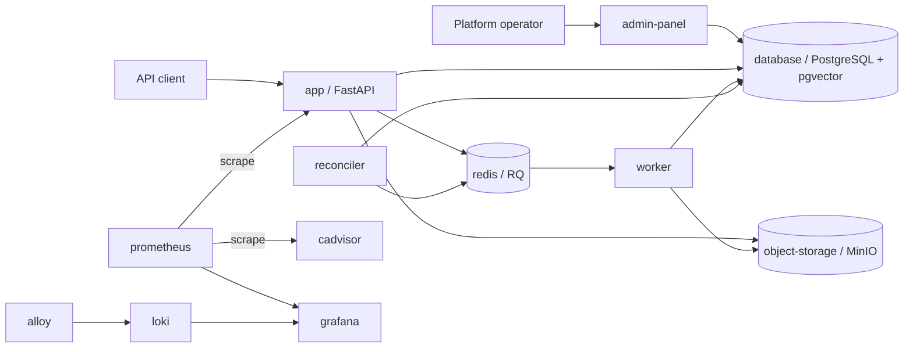

# Applications and services

This page explains the containers defined in [`docker-compose.yaml`](../../docker-compose.yaml):
what each one does, when it runs, and whether it has a browser or HTTP endpoint. The
default stack runs with `docker compose up --build`. Optional Compose profiles add the
Admin Panel, observability tools, or the operator command.

## At a glance

| Service | Purpose | Started by | Access from the host |
| --- | --- | --- | --- |
| `app` | FastAPI gateway for authentication, document ingestion, jobs, document administration, and evidence-grounded queries | Default | `http://127.0.0.1:8000` (Compose publishes port 8000 on all host interfaces) |
| `worker` | RQ process that extracts text, runs OCR and NER, chunks documents, creates embeddings, and marks versions ready | Default | No HTTP port |
| `reconciler` | Recovers durable jobs that were not queued or became stale; retries eligible transient failures | Default | No HTTP port |
| `database` | PostgreSQL with pgvector; system of record for identities, documents, versions, jobs, profiles, chunks, and vectors | Default | `127.0.0.1:5432` for local database tools |
| `redis` | RQ job delivery and query rate-limit state | Default | No host port |
| `object-storage` | MinIO storage for immutable original uploads | Default | No host port |
| `admin-panel` | Browser interface for platform operators to create, review, validate, and activate configuration profiles | `admin` profile | `http://127.0.0.1:8001` |
| `profile-operator` | Command-line alternative for the same profile approval workflow | `operator` profile, run on demand | No HTTP port |
| `grafana` | Dashboards, log exploration, and alert-rule evaluation | `observability` profile | `http://127.0.0.1:3001` |
| `prometheus` | Collects metrics from the API and cAdvisor | `observability` profile | No host port |
| `cadvisor` | Supplies Docker resource metrics to Prometheus | `observability` profile | No host port |
| `alloy` | Collects Docker logs and forwards them to Loki | `observability` profile | No host port |
| `loki` | Stores and serves logs to Grafana | `observability` profile | No host port |

The `database-test` and `redis-test` containers belong to the disposable `test` profile.
They are for integration tests and are not part of normal operation.

## How the applications work together

The API stores an original upload before accepting its job. The worker later creates
version-scoped search data. A tenant administrator selects which ready document version
is current. A platform operator separately activates ingestion and query configuration
profiles through the Admin Panel. New jobs use the active ingestion profile at creation;
existing jobs keep their assigned profile. Each query uses the active query profile
resolved at request start. Older indexed documents remain searchable while the query
profile includes their lexical and embedding read cohorts.

## User-facing endpoints

### API (`app`)

The API is the application's public service. Its local OpenAPI page is
`http://127.0.0.1:8000/docs`. Clients use authenticated endpoints such as `POST /ingest`,
`POST /query`, and `GET /jobs/{job_id}`. The API enforces tenant and department access
before retrieval. Its `/metrics` endpoint is for authenticated Prometheus scraping,
not ordinary API clients.

### Document Insight Admin Panel (`admin-panel`)

Start with `docker compose --profile admin up --build -d admin-panel`, then open
`http://127.0.0.1:8001/`. Sign in with `ADMIN_PANEL_USERNAME` and
`ADMIN_PANEL_PASSWORD` from the local `.env`. The panel stages capability profiles,
validates supported configurations, assembles ingestion and query bundles, and activates
them with an expected revision and audit reason. It uses a dedicated profile-operator
database login and does not have document-content access. The local port is bound to
loopback; production requires an internal TLS-protected ingress.

The `profile-operator` CLI offers the same approval workflow for scripts or emergency
operations. It runs only when invoked, for example with
`docker compose --profile operator run --rm profile-operator --help`.

### Grafana (`grafana`)

Start with `docker compose --profile observability up --build`, then open
`http://127.0.0.1:3001/`. Sign in as `admin` using `GRAFANA_ADMIN_PASSWORD` from
`.env`. Provisioned dashboards cover system resources and API traffic, RAG query
outcomes, ingestion-job health, logs, and alert status. Prometheus, Loki, cAdvisor, and
Alloy are supporting services without published host ports. See
[ADR 005](../adr/005-observability.md) for the signals and production requirements.

## Background and storage services

- **Worker:** Consumes the `ingestion` RQ queue. It parses PDF and image uploads,
  detects language, extracts entities, creates chunks and embeddings, and moves a
  processed version to `ready`. Processing never activates a document version.
- **Reconciler:** Checks PostgreSQL's durable job ledger and republishes missing or stale
  work within the retry policy. It does not retry permanent or exhausted failures.
- **PostgreSQL/pgvector:** Holds authoritative records, including profile activation
  pointers and audit history. The local database port is loopback-only; application
  containers connect on the private Compose network with restricted database roles.
- **Redis/RQ:** Delivers asynchronous jobs. PostgreSQL, rather than Redis, determines
  durable job state.
- **MinIO:** Stores original files. The default Compose configuration exposes neither
  its API nor its console on a host port.

## Startup helpers and test containers

Some Compose services run once and exit successfully:

| Service | Startup task |
| --- | --- |
| `object-storage-init` | Creates the original-upload bucket in MinIO |
| `migrate` | Applies Alembic database migrations |
| `bootstrap-roles` | Provisions restricted database login roles from external secrets |
| `prometheus-multiproc-init` | Clears the local shared metrics directory before API and workers start |
| `monitoring-token-init` | Writes the private metrics scrape token for the observability profile |
| `test-migrate`, `test-bootstrap-roles` | Prepare only the disposable test database |

These are setup jobs, so an `Exited (0)` status is expected. Use
`docker compose ps -a` to see the current local state and
`docker compose logs -f app worker reconciler` to follow the core processes. For setup
and configuration details, see the [project README](../../README.md).
